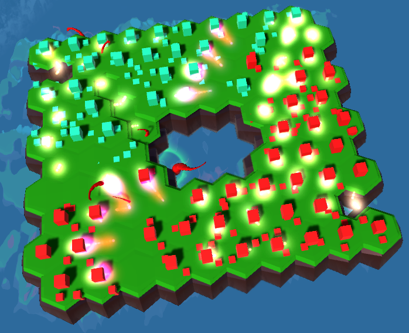
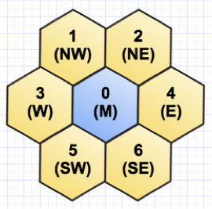
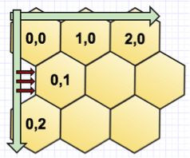
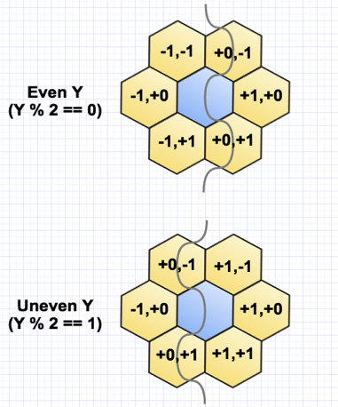

## AIsland

During [Joy of Coding 2017](http://joyofcoding.org) the huge video wall at De Rotterdamse Schouwburg will be running a programming contest, called AIsland.

AIsland challenges you to program a bot to compete in a digital board game. Moves are made by automatically calling a RESTful web service using JSON. You can use any programming language you like, as long as it runs independently and performs HTTP requests to the web service.

You can call the web service at the following URL:

    http://172.16.32.50:8080

You can inspect the Swagger page here:

    http://172.16.32.50:8080/swagger-ui.html
    
### Challenge

So the challenge is to program a bot that competes in a digital board game. First you have to register, so you can be identified as a player after login. Each game round there are a limited number of spots, so you might have to queue first. But once you're in, the purpose of the game is to conquer nodes, by spreading from the nodes you own to other nodes. If you conquer them all, you win.

### Register

In order to play you would have to register as a user first.

	POST /players/register

In the body of the request you will supply your name, email and password, for instance:

    {
      "name": "Kathy",
      "email": "kathy@example.com",
      "password": "secret"
    }

As in all subsequent requests, you will need to supply the correct headers:

| Header | Value |
| --- | --- |
| Content-Type | application/json |
| Accept | application/json |
    
A `201` response from the server means you have been added to the list of players. You can check out the list in order to figure out which user id you have been given:

    GET /players
    
The result will look like this:

    [
      ...,
      {
        "id": 42,
        "name": "Kathy",
        "winCount": 0,
        "blocked": false
      }
    ]

So we were given an `id` of 42. It also shows a total of zero wins (duh) and that we haven't been blocked (yet). So if all goes well, `winCount` will go up and `blocked` will remain `false` (you will be blocked as a user in case of foul play, or undermining the game in any sort of way).

### Login

To login, do:

    POST /players/login
    
With a JSON body like this:

    {
      "email": "kathy@example.com",
      "password": "secret"
    }
    
In the response a token is returned, that you will need in order to enter the game and play matches:

    {
      "value": "AC5738D6BF937C4399D3747AE081783D"
    }

So it is suggested you store it for later use.

### Queue

Although the video wall at De Schouwburg is kind of huge, the screen might still be too small in order to accomodate all players at the same time. Therefore, in order to enter the game, you should enter the queue first:

    PUT /queue/{playerId}/{token}
    
In Kathy's case:

    PUT /queue/42/AC5738D6BF937C4399D3747AE081783D
    
A `201` response means the operation was successful.

You can inspect the queue like this:

    GET /queue
    
Which amounts to something like this:

	{
		"maxCount": 50,
		"players": [
			{
				"id": 3,
				"name": "Paul",
				"winCount": 1,
				"blocked": false
			},
			{
				"id": 42,
				"name": "Kathy",
				"winCount": 0,
				"blocked": false
			},
			...
		]
	}

So Kathy has become second in line, out of a maximum total of 50 users that can be held in the queue.

### Enter

After each round, users are taken from the queue, and are set up to enter a match. So after entering the game you should check `rounds` regularly to find out if you've been selected to perform in a match, and against which opponent:

    GET /rounds
    
Response:

    [
      {
        "id": 1,
        "players": [
          {
            "id": 1,
            "name": "John",
            "winCount": 3,
            "blocked": false
          },
          {
            "id": 42,
            "name": "Kathy",
            "winCount": 0,
            "blocked": false
          }
        ],
        "maxPlayerSize": 2,
        "turn": 10,
        "ended": false,
        "matchRules": {
          "id": 1,
          "actionCosts": {
            "EMPOWER": 8,
            "POWERLINE": 46,
            "OVERCLOCK": 58,
            "STORAGE": 16,
            "SLEEP": 0,
            "DISCHARGE": 26,
            "SPREAD": 11,
            "SPREADALL": 14,
            "SPREADLINE": 63,
            "GUARD": 63,
            "EXPLODE": 65,
            "DRAIN": 4
          },
          "fluctuation": 0.2
        },
        "playerCount": 2
      }
    ]

So that means we're in, and we can make some moves in this match. But before we do, we should find out what the board looks like.

### Map

To inspect the board, we call:

    GET /rounds/{roundId}/map
    
In our case `matchId` equals 1. The result will look something like this:

    {
      "id": 1,
      "width": 10,
      "height": 10,
      "nodes": [
        {
          "id": 0,
          "power": 100,
          "ownerId": 1,
          "type": 0
        },
        {
          "id": 100,
          "power": 0,
          "ownerId": 0,
          "type": 0
        },
        ...
      ]
    }

So the board consists of `10 x 10 = 100` nodes, and John - our competitor - is sitting on the very first node at `0,0`.

### Play

Now, the purpose of this game is to remove all other players from this game board, by spreading from the nodes you own to all other nodes through a series of actions:

| Action | Name | Description | Cost (example) |
| --- | ------ | ----------- | -------------- |
| 0 | SLEEP | Do nothing | 0 |
| 1 | SPREAD | Spreads to 1 adjacent node | 11 |
| 2 | SPREADALL | Spreads to all adjacent nodes | 14 |
| 3 | SPREADLINE | Spreads to 5 nodes in a straight line from this node | 63 | 
| 4 | EMPOWER | Gives 5% power to adjacent node with lowest power | 8 |
| 5 | DISCHARGE | Splits remaining power with adjacent node and sells special type | 26 |
| 6 | POWERLINE | Nodes can consume the power from adjacent or connected powerline nodes | 46 | 
| 7 | OVERCLOCK | This node becomes overclocked, an overclocked node generates power 3x as fast | 58 | 
| 8 | GUARD | A guarded node is protected against 1 takeover and blocks line spreads | 63 |
| 9 | STORAGE | This node can store 3x as much power | 16 |
| 10 | DRAIN | Consumes 5 power from an adjacent enemy node | 4 |
| 11 | EXPLODE | Neutralizes all nodes within two tiles of this node, including your own | 65 |

So there are many ways to conquer nodes, but each will cost you a certain amount of 'power' units. How much, you will be able to look up in the `/rounds` response (see before).

On the other hand, each node you conquer will gain you its power. Moreover, each turn, the power of a node increases to a maximum of 100.

So ultimately you would have to balance the actions based on the power you possess, and make strategic choices.

### Move

To conquer a node you need to move to it. At each turn, you are allowed to make at most one move for each node that you own, and tell the server how (action) and whereto (direction) you want to make those moves.

    POST /rounds/{roundId}/players/{playerId}/moves
    
For example, with body:

    [
      {
        "action": 1,
        "direction": 1,
        "x": 5,
        "y": 6
      },
      {
        "action": 2,
        "direction: 2,
        "x": 7,
        "y": 9
      },
      ...
    ]

So we see two nodes (`5,6` and `7,9`) that are conquered using two types of action (`SPREAD` and `SPREADALL`) in a certain direction. Since we are dealing with hexagons (e.g. instead of squares), we've got 6 directions that we can move to:

| Direction | Heading |
| --------- | ------- |
| 0 | CENTRAL |
| 1 | NORTH WEST |
| 2 | NORTH EAST |
| 3 | WEST |
| 4 | EAST |
| 5 | SOUTH WEST |
| 6 | SOUTH EAST |

To determine the actual position and neighbours of a hexagonal node is a little bit more complicated than using squares. The tiling is in such a way that horizontally the tiles align as normal but vertically they are adjacent to two tiles on each side, because each other row is shifted forward.

This makes it so that the coordinates of the adjacent nodes depend on the Y-position of the current node. 

### Kit

In order to get you up to speed, there are starter kits are available to you for the following languages:

- [Java](https://github.com/Dionvd/JCIC-JavaStarter)
- [Clojure](https://github.com/mamersfo/aisland-clj)
